# Club Platform – ausführliche Bedienungsanleitung

Stand: 20. September 2026 · Entwicklungsstand mit Schema 18 und sieben Fachmodulen.
Diese Anleitung beschreibt den vorhandenen Funktionsumfang. Sie ist keine
Produktivfreigabe. Die Abbildungen verwenden erfundene Testdaten. „Desktop“ im
Portal-Bildpfad bedeutet Browser am großen Bildschirm. Gesondert beschriftete
Qt-Aufnahmen stammen aus dem nativen Linux-Test; dort ist Englisch ausgewählt,
einige noch nicht übersetzte Beschriftungen erscheinen auf Deutsch.

## Inhalt

1. [Start, Anmeldung und Orientierung](#start-anmeldung-und-orientierung)
2. [Listen, Suche und Filter](#listen-suche-und-filter)
3. [Personen und Akten](#personen-und-akten)
4. [Organisationen](#organisationen)
5. [Benutzer, Gruppen und Berechtigungen](#benutzer-gruppen-und-berechtigungen)
6. [Lizenzen und Erweiterungen](#lizenzen-und-erweiterungen)
7. [Kampfsport](#kampfsport)
8. [Finanzen](#finanzen)
9. [Beiträge und Mahnungen](#beiträge-und-mahnungen)
10. [Produkte, Käufe und Rückgaben](#produkte-käufe-und-rückgaben)
11. [Bankimport und Zahlungszuordnung](#bankimport-und-zahlungszuordnung)
12. [Kalender und Erinnerungen](#kalender-und-erinnerungen)
13. [Veranstaltungen](#veranstaltungen)
14. [Dokumente und Auswertungen](#dokumente-und-auswertungen)
15. [Einstellungen](#einstellungen)
16. [Sicherung und Wiederherstellung](#sicherung-und-wiederherstellung)
17. [Fehler und Prüfliste](#fehler-und-prüfliste)

Der [Formularatlas](formulare.md) ergänzt die vollständige Liste der Finanz- und
Terminaktionen mit allen Feldern. Die [Platzhalterliste](placeholders.md) enthält
alle 70 festen Dokumentplatzhalter, Aliase und Regeln für benutzerdefinierte Felder.

## Start, Anmeldung und Orientierung

### Vor dem ersten Einsatz

Lass Dir vom Administrator Benutzername und Zugang nennen. Klärt außerdem,
welche Organisationen Du verwaltest und welche Module benötigt werden.
Personenakten benötigen keine Kampfsportlizenz; Kampfsport, Finanzen, Beiträge,
Käufe, Kalender, Veranstaltungen und Banking werden separat freigeschaltet.

Im Einzelplatzbetrieb liegen Daten und Anwendungsdienst auf Deinem Rechner.
Im Serverbetrieb arbeiten Desktop oder Browser mit dem gemeinsamen Server.
Eine lokale Testdatenbank und die Datenbank des Servers sind unterschiedliche
Bestände. Ein neu angelegter Datensatz erscheint nur bei Clients desselben Hosts.

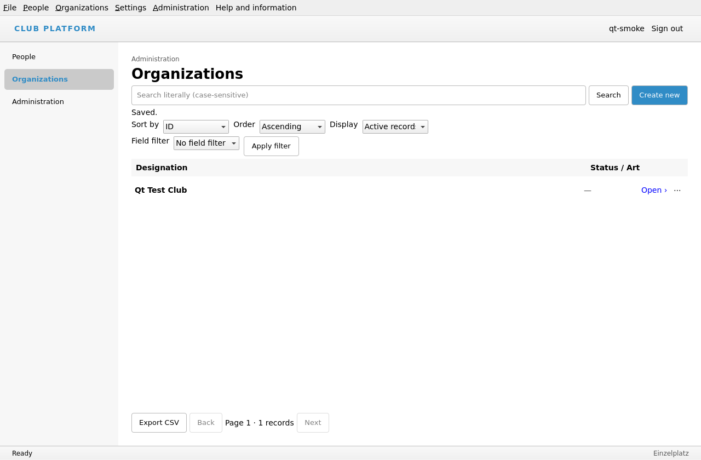

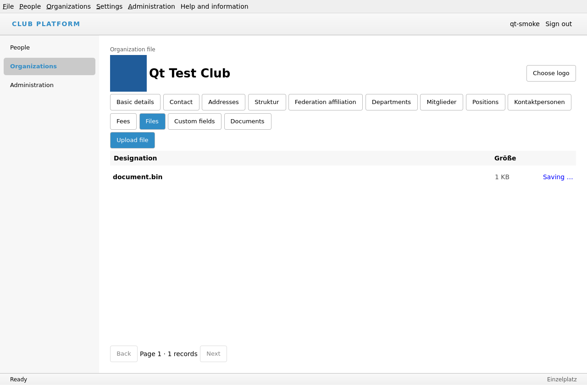

### Auf Deinem Mac bauen und starten

Im Verzeichnis des **Code-Repositories**:

```bash
cmake --preset user-macos-vscode-debug
cmake --build --preset user-macos-vscode-debug --parallel
ctest --test-dir build/user-macos-vscode-debug --output-on-failure
./scripts/run-dev-macos.sh
```

Dein vorhandenes Preset bleibt der richtige Weg. Nach einer Quellcodeänderung
musst Du neu bauen und die Anwendung neu starten. Nach Änderungen an nativen
Modulen diese zusätzlich unter Erweiterungen installieren/aktualisieren.
Eine `.app` ist ein Verzeichnis: Verwende das Startskript oder `open`, nicht
`./…/clubplatform-desktop.app`. Beim direkten Start liegt die ausführbare Datei
unter `Contents/MacOS/clubplatform-desktop`.

Den Browser-Test mit getrenntem Server und Portal beschreibt
[Lokaler Test](operations.md#lokaler-test). Ein bereits eingerichteter Host wird
ohne `--init` gestartet; damit legst Du nicht bei jedem Start einen neuen Admin an.

### Anmelden und abmelden

1. Starte die Anwendung beziehungsweise öffne die Portaladresse.
2. Trage Benutzername und Passwort ein und wähle **Anmelden**.
3. Warte auf die Personenübersicht. In der Kopfzeile stehen angemeldeter Benutzer
   und **Abmelden**. Modulzugänge erscheinen erst bei einsatzbereiten Modulen.
4. Beende Deine Arbeit mit **Abmelden**, insbesondere an gemeinsam genutzten Geräten.

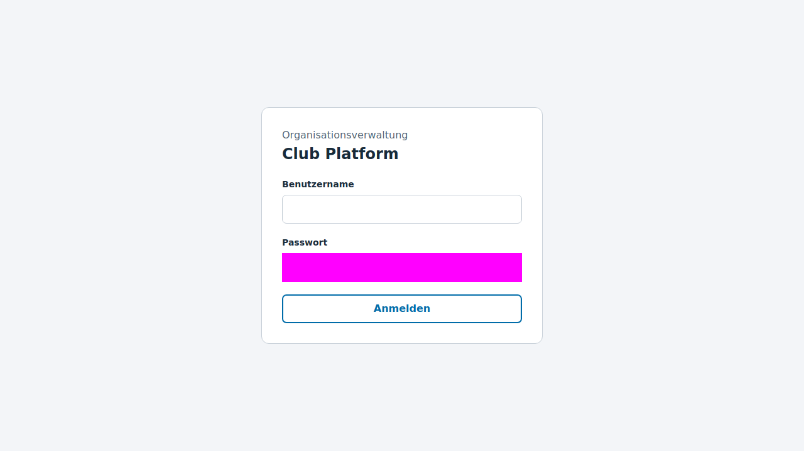

Bei abgelaufener Sitzung melde Dich erneut an. Eingaben, die noch nicht gespeichert
wurden, sind keine gespeicherten Datensätze. Nach einem Verbindungsfehler prüfe
zuerst die Liste, bevor Du denselben Vorgang neu anlegst.

## Listen, Suche und Filter

Die Hauptnavigation führt zu Personen, Organisationen und Administration.
Ein großer Bildschirm zeigt Reiter; auf schmalen Geräten ersetzt **Aktenbereich**
die Reiter durch eine Auswahlliste. **Zur Liste** verlässt die geöffnete Akte.

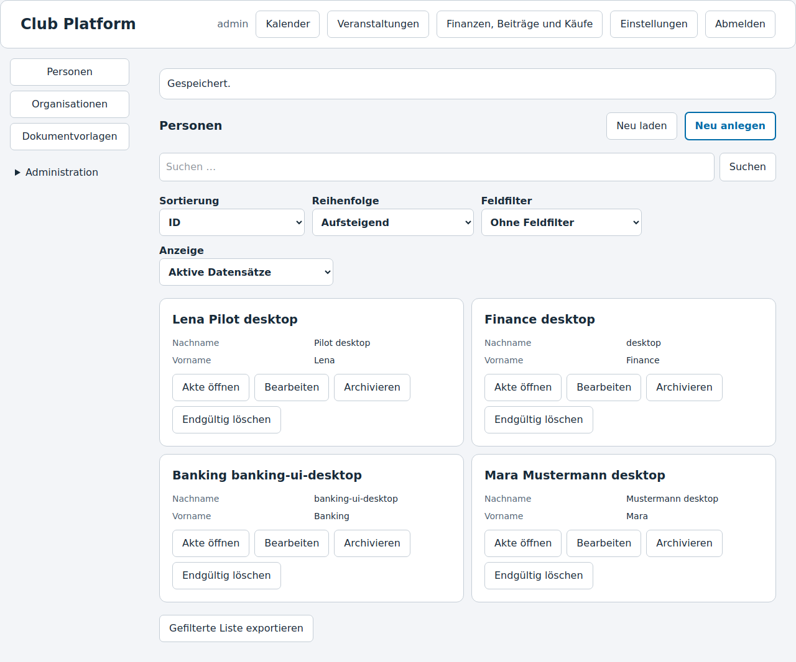

1. Wähle den gewünschten Bereich.
2. Trage einen Suchbegriff ein. Beachte die angezeigten Hinweise zur
   Groß-/Kleinschreibung; die Suche ist nicht automatisch eine unscharfe Namenssuche.
3. Wähle unter **Sortierung** das Feld und auf-/absteigende Richtung.
4. Für einen genauen Feldvergleich wähle **Feldfilter**, Vergleich und **Filterwert**.
5. Wähle den Archivstatus: aktiv, archiviert oder alle.
6. Blättere mit dem vorhandenen Weiter-/Nachladen-Zugang durch größere Bestände.
   Ein leerer Bildschirm nach dem Filtern bedeutet nicht, dass Daten gelöscht sind.

| Vergleich | Beispiel | Bedeutung |
|---|---|---|
| Gleich | Nachname = Müller | Feld muss dem Wert entsprechen |
| Ungleich | Status ≠ beendet | Passende Werte ausschließen |
| Kleiner als | Datum < 2026-10-01 | Werte vor der Grenze |
| Kleiner oder gleich | Datum ≤ 2026-10-01 | Grenze eingeschlossen |
| Größer als | Zahl > 10 | Werte oberhalb der Grenze |
| Größer oder gleich | Zahl ≥ 10 | Grenze eingeschlossen |
| Enthält | Bezeichnung enthält Training | Teiltext im Feld suchen |

Der Wert muss zum Datentyp passen. Verwende für Datumsfelder den Kalenderwähler.
Eine Zahl und ein Datum sind keine beliebigen Freitexte. Sortierung und Filter
werden je Bereich beibehalten; entferne einen alten Filter, wenn Einträge fehlen.

### Ändern, archivieren, wiederherstellen und löschen

**Bearbeiten** öffnet vorhandene Werte. Ändere diese und wähle **Speichern**.
**Abbrechen** verwirft den Entwurf nach Bestätigung. Wenn eine andere Sitzung
denselben Datensatz geändert hat, lade ihn neu und prüfe die aktuellen Werte.

**Archivieren** nimmt einen Datensatz aus dem aktiven Bestand. Wähle anschließend
den Archivfilter, um ihn zu sehen. **Wiederherstellen** macht ihn wieder aktiv.
Archivierte Datensätze müssen vor dem Bearbeiten wiederhergestellt werden.

**Endgültig löschen** funktioniert nur, wenn keine geschützten Verknüpfungen
bestehen. Beispielsweise können Mitgliedschaften, Konten oder Moduldatensätze
eine Person oder Organisation weiterhin benötigen. Es gibt keine unbemerkte
Kaskadenlöschung. Fehlt ein für die Referenzprüfung benötigtes Modul, stelle
dessen passende Datei wieder bereit. Finanzbelege werden durch Storno korrigiert.

## Personen und Akten

### Person anlegen

1. Öffne **Personen → Neu anlegen**; im nativen Desktop heißt der direkte Einstieg
   gegebenenfalls **Person anlegen**.
2. Erfasse Vor- und Nachname. Prüfe vorher, ob die Person bereits vorhanden ist.
3. Speichere und öffne **Akte öffnen** in der zugehörigen Zeile.
4. Ergänze die folgenden Bereiche. Ein Foto ersetzt keinen gespeicherten Namen.

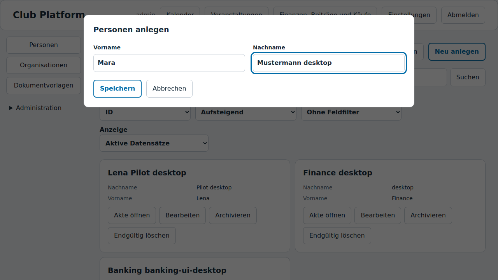

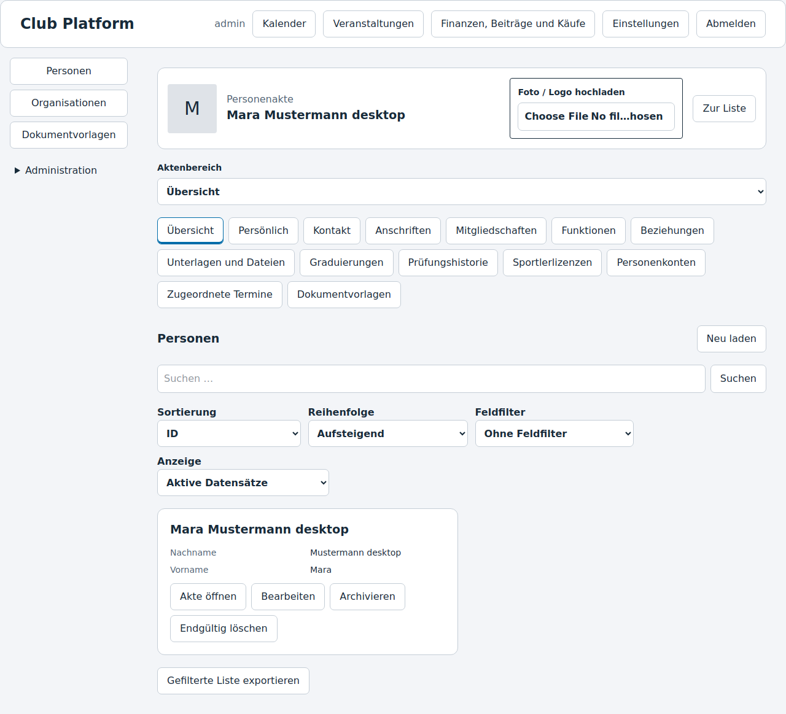

| Aktenbereich | Was Du dort pflegst | Vorgehen |
|---|---|---|
| Person | Vor- und Nachname | Bestehenden Eintrag bearbeiten |
| Persönliche Daten | Geburtsdatum, Anrede, Geschlecht, Sorgeberechtigte, Notfallkontakt | Datensatz anlegen/öffnen, passende Person prüfen, speichern |
| Kontakte | E-Mail, Telefon oder anderer Kontakt, Bezeichnung und Wert | Pro Kontakt einen Eintrag anlegen, z. B. „Mobil“ |
| Adressen | Bezeichnung, Straße, Postleitzahl, Ort, Land | Mehrere Adressen getrennt führen |
| Mitgliedschaften | Organisation, Mitgliedsnummer, Status, Beginn/Ende, Abteilung, Beitragsgruppe | Organisation bewusst auswählen; Kündigung und Austrittsgrund bei Bedarf ergänzen |
| Funktionen | Organisation, Funktionsbezeichnung und Gültigkeit | Anfang/Ende pflegen; abgelaufene Funktionen gewähren keinen aktuellen Organisationszugriff |
| Beziehungen | Organisation, Beziehungsart und Zeitraum | Z. B. Förderer/Sponsor als Beziehung dokumentieren |
| Dateien | Dokumente und sonstige Anlagen | Datei auswählen, hochladen, anschließend aus der Liste öffnen/herunterladen |
| Kampfsport-Reiter | Graduierungen, Prüfungen, Sportlerlizenzen | Nur bei einsatzbereitem Kampfsportmodul |
| Finanzkonto | Konten, Saldo und Buchungen | Nur mit freigeschaltetem Finanzmodul und passenden Rechten |
| Termine | Zugeordnete Termine | Nur mit freigeschaltetem Kalender und passenden Rechten |
| Dokumentvorlagen | Personenbezogene Dokumentausgabe | Vorlage und Kontext prüfen, Vorschau/PDF erstellen |

In Formularen ist die aktuelle Person häufig vorausgewählt. Prüfe die Auswahl
vor dem Speichern, insbesondere wenn Du aus der Administration statt aus einer
Akte kommst. Eine Benutzeranmeldung wird nicht automatisch aus einer Person erzeugt.

### Dateien, Fotos und Nachweise

Verwende das Foto-/Logo-Feld für das Aktenbild und den Reiter **Dateien** für
Unterlagen. Für ein Foto oder Logo werden PNG/JPEG unterstützt. Wähle eine
Datei, warte auf den abgeschlossenen Upload und prüfe den Listeneintrag.
Mehrere Unterlagen werden als separate Dateien hochgeladen. Sportlerlizenznachweise
gehören direkt zur jeweiligen Lizenz, damit sie nicht mit allgemeinen Aktenanlagen
verwechselt werden. Passe bei einem Uploadfehler Größe/Format entsprechend der
Fehlermeldung an; wiederholtes Auswählen derselben Datei ist kein Erfolgshinweis.

### Benutzerdefinierte Felder

Die native Administration bietet Felddefinitionen und gruppenbezogene Feldrechte.
Definiere den Datensatztyp, einen eindeutigen Feldschlüssel und Datentyp.
Vergib Lesbarkeit und Schreibbarkeit nur an die vorgesehenen Gruppen. Prüfe die
Ansicht anschließend mit einem normalen Benutzer. Das Portal bietet derzeit
keinen gleichwertigen vollständigen Editor für Felddefinitionen/Feldrechte.
Ein als Dokumentplatzhalter verwendetes benutzerdefiniertes Feld unterliegt
ebenfalls den Feldrechten; die Dokumentausgabe umgeht diese nicht.
In der Akte verwendest Du **Benutzerdefinierte Felder**, um berechtigte Werte
einzutragen oder über **Wert entfernen / nicht gesetzt** zu leeren. Das ist von
einer leeren Zeichenkette zu unterscheiden. Eine nachträgliche Änderung des
Feldtyps migriert vorhandene Werte; prüfe sie vorher an einer Sicherung.

## Organisationen

1. Öffne **Organisationen**, wähle **Neu anlegen** und erfasse den Namen.
2. Wähle die Art: Verein, Sportschule, Verband, Landesverband, Unternehmen oder
   Sonstiges. Organisation ist der gemeinsame Oberbegriff.
3. Wähle optional die übergeordnete Organisation. Lege sie vorher an, falls sie
   noch nicht in der Auswahl steht. Eine Verbandsstruktur ist keine Mitgliedschaft.
4. Ergänze Kurzname, Gründungsdatum, Registerdaten, Website und Kontaktdaten.
5. Öffne die Organisationsakte. Pflege dort Kontakte, Adressen, Zugehörigkeiten,
   Abteilungen, Beitragsgruppen, Mitgliedschaften, Funktionen, Beziehungen und Dateien.
6. Öffne bei freigeschaltetem Finanzmodul dessen Währungsansicht und lege die
   Organisationswährung fest, **bevor** Konten oder Gebühren entstehen.

Eine Abteilung trägt Name und Sportart. Eine Organisationszugehörigkeit verbindet
die aktuelle Organisation mit einer anderen Organisation und einer Beziehungsart.
Die Stamm-Beitragsgruppen sind von den abrechenbaren Beitragsplänen im Fachmodul
zu unterscheiden: Erst ein Beitragsplan samt Zuweisung erzeugt beim Abrechnen Forderungen.

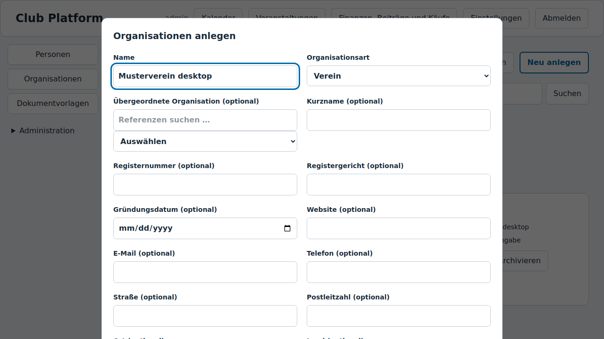

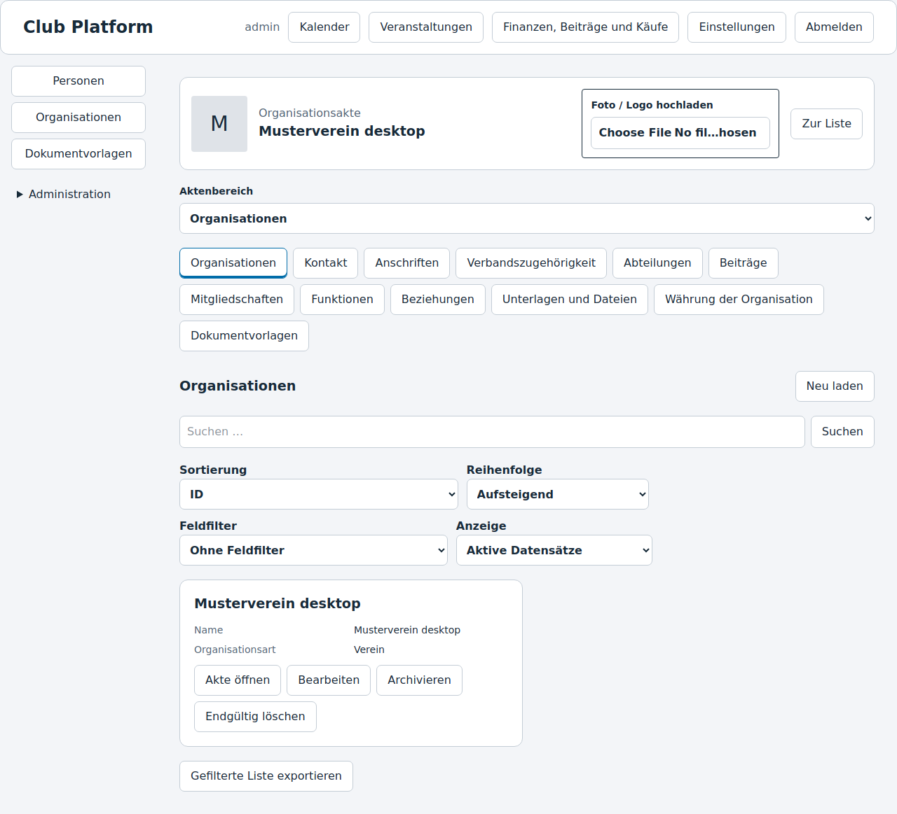

Bei bestehenden Finanzdaten wird ein Währungswechsel abgelehnt. Die Anwendung
rechnet weder historische Beträge um noch führt sie einen Wechselkursbestand.

## Benutzer, Gruppen und Berechtigungen

### Einen Zugang zu einer Person einrichten

1. Lege zuerst die Person an.
2. Öffne **Administration → Benutzer → Neu anlegen**.
3. Erfasse eindeutigen Anmeldenamen, ein ausreichend langes Passwort und die Person.
4. Speichere. Ein Personendatensatz kann nicht mehreren Benutzerkonten gleichzeitig
   zugeordnet werden.
5. Ordne den Benutzer einer Gruppe mit den benötigten Rollen zu.
6. Melde Dich testweise in einem getrennten Browserprofil mit diesem Benutzer an.
   Prüfe Lesen und Schreiben getrennt und teste einen fremden Datensatz.

Beim Bearbeiten eines vorhandenen Benutzers lassen sich Aktivstatus und
Personenverknüpfung ändern. Die Kontoaktivierung ist keine Modullizenzierung.
Der native Desktop bietet außerdem **Passwort ändern** für das eigene Passwort.

### Rechte über Gruppen und Rollen vergeben

Gruppen bündeln Benutzer; Rollen bündeln Rechte. Der Weg lautet:
**Benutzer → Gruppe → Rolle → Berechtigung**.

1. Lege unter **Gruppen** eine sprechend benannte Gruppe an.
2. Öffne die Gruppe beziehungsweise **Gruppenmitglieder** und füge Benutzer hinzu.
3. Lege unter **Rollen** die benötigte Rolle an.
4. Öffne den Rollendialog. Wähle ein Recht aus dem Auswahlmenü und lies den Infotext.
5. Wähle **Hinzufügen**. Bereits zugeteilte Rechte stehen im selben Dialog und
   können über **Entfernen** entzogen werden.
6. Öffne **Rollenzuweisung**, wähle die Gruppe und füge die Rolle hinzu.

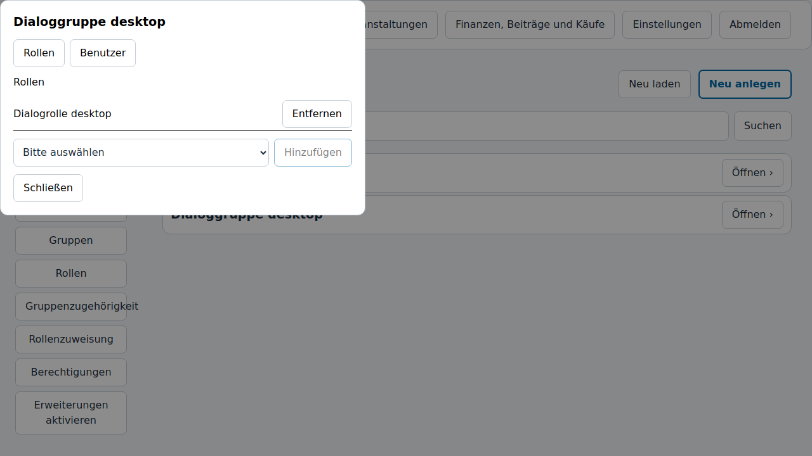

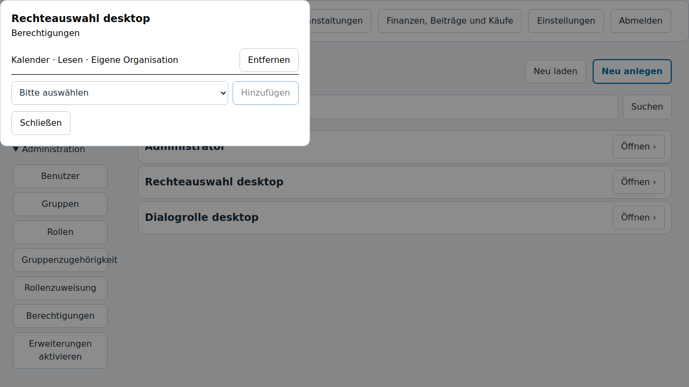

**Eigene Person** setzt die Benutzer-/Personenverknüpfung voraus. **Eigene
Organisation** verlangt zusätzlich die vorgesehene aktuelle Funktion in einer
Organisation, zu der die betroffene Person gehört. **Global** kann über diese
Grenzen hinausgehen. Bereichsrechte ersetzen gegebenenfalls erforderliche
Grundrechte nicht. Halte Dich an den Infotext der konkreten Berechtigung.

Ein Administrator darf sich durch Änderungen an Gruppen, Rollen, Rechten oder
Kontostatus nicht selbst die effektiven allgemeinen Rechte nehmen. Ein solcher
Vorgang wird vollständig zurückgerollt. Die bloße Existenz eines zweiten Admins
hebt diesen Selbstschutz nicht auf. Verwende einen getrennten administrativen
Zugang, wenn der bisherige Zugang gezielt abgelöst werden soll.

## Lizenzen und Erweiterungen

Softwarelizenzen schalten Module frei; **Sportlerlizenzen** sind fachliche Nachweise
einer Person. Die beiden Bereiche haben unterschiedliche Zwecke.

Im nativen Desktop: **Administration → Erweiterungen**. Im Portal:
**Einstellungen → Lizenz und Module / Erweiterungen**.

Die Modulübersicht findest Du in den Einstellungen. Der Entwicklungsstand
`e1bd8f8` zeigt für jedes Modul eine eigene Karte. Auf breiten Bildschirmen
stehen die Karten nebeneinander, auf schmalen untereinander. Jede Karte nennt
Version, Fund- und Ladestatus, Installation, Lizenzstatus, Betriebsstatus und
Dateiname. Die Schaltflächen unterhalb der Werte gelten nur für dieses Modul.

Der [bisherige Pilot-Ausschnitt](../images/pilot/desktop/settings-modules.png)
zeigt noch die frühere Tabelle. Die Browserabnahme und neue Aufnahmen für die
Kartendarstellung stehen aus; siehe [Prüfstatus](../status.md).

1. **Lizenz prüfen** beziehungsweise Status laden.
2. Die vom Herausgeber erhaltene signierte Lizenzdatei importieren.
3. Bei gebundener Lizenz **Aktivieren** ausführen. Die Installation benötigt dazu
   den eingerichteten Aktivierungsdienst oder den ausdrücklich erlaubten Offlineweg.
4. Moduldateien aus dem vorgesehenen Katalog installieren oder vorhandene Dateien
   über **Installieren / aktualisieren** in den Datenbestand übernehmen.
5. Das gewünschte Modul aktivieren und prüfen, ob es einsatzbereit ist.

| Anzeige | Bedeutung / nächste Aktion |
|---|---|
| Gefunden | Die Datei wurde erkannt; sagt noch nichts über Nutzbarkeit |
| Geladen | Die technische Moduldefinition wurde geladen |
| Installiert | Modulschema und Registrierung sind im Datenbestand vorhanden |
| Nicht lizenziert | Lizenz/Aktivierung prüfen; ein geladener Dateiname ist keine Freischaltung |
| Deaktiviert | Bei gültiger Lizenz über Aktivieren einschalten |
| Aktualisierung erforderlich | Passende Module installieren/aktualisieren |
| Installiert, Datei nicht geladen | Moduldatei beziehungsweise konfiguriertes Verzeichnis prüfen |
| Ladefehler | Angegebenen Diagnosecode und Dateinamen prüfen; passende Datei bereitstellen und Host neu starten |

Bei einem Ladefehler wird die gesamte staged Modulgruppe zurückgehalten; keine
teilweise erfolgreiche Registrierung wird als nutzbar angezeigt. Ein Administrator
kann den Kern zur Diagnose öffnen. Versions-/Migrationsfehler außerhalb dieser
Dateiladeprüfung können den Start weiterhin abbrechen.

Lizenzentzug löscht keine Fachinformationen. Er kann Funktionen ausblenden oder
sperren. Die Benutzerrechte werden zusätzlich zur Lizenz geprüft. Das Kopieren
einer Lizenzdatei ersetzt bei gebundenen Lizenzen nicht die Installationsaktivierung.

Für Rechnerwechsel zuerst die alte Aktivierung freigeben und auf dem neuen Host
erneut aktivieren. Ein Server bindet die Lizenz für seine Installation, nicht
separat für jeden Browser. Herstellerseitige Lizenzanlage:
[Lizenz mit allen Modulen erstellen](lizenz-alle-module.md).

## Kampfsport

### Graduierung und Prüfung erfassen

Öffne die Personenakte und den jeweiligen Kampfsportreiter. Wähle **Neu anlegen**.
Bei einer Graduierung erfasse Disziplin/Stil, Stufe, Bezeichnung, Verleihungsdatum
und Prüfer. Bei einer Prüfung erfasse Disziplin, Stufe, Prüfungsdatum, Ergebnis,
Prüfer und Notizen. Speichere und kontrolliere die zugeordnete Person.

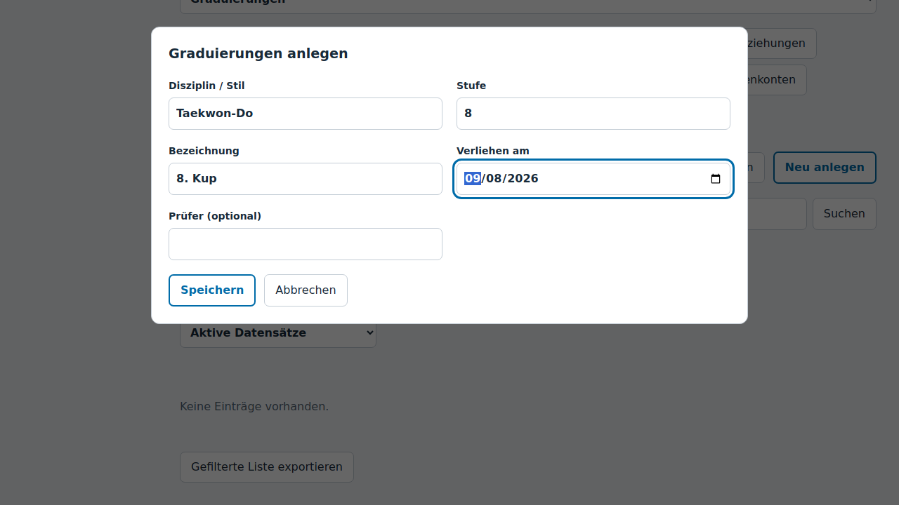

Bei mehreren Disziplinen wähle bei der Dokumentausgabe den richtigen Datensatz.
Die Software nimmt nicht willkürlich irgendeine Graduierung als die aktuelle.

### Sportlerlizenz mit Nachweisen

1. Öffne in der Personenakte **Lizenzen** des Kampfsportmoduls.
2. Erfasse Lizenzname, Erteilungsdatum und Ablaufdatum.
3. Wähle die erteilende Organisation oder trage die Stelle als Freitext ein.
4. Gib den Warnzeitraum in Tagen an, beispielsweise `30` für einen Monat Vorlauf.
5. Speichere und öffne die Nachweise der Lizenz.
6. Lade Fotos der Lizenz oder Prüfungsdokumente einzeln hoch. Kontrolliere jeden Upload.
7. Prüfe bei freigeschaltetem Kalender den abgeleiteten Ablauftermin und die Warnung.

Ändere Ablaufdaten an der Sportlerlizenz selbst. Der Kalender projiziert die
aktuellen Fachinformationen und führt keine unabhängig zu pflegende Kopie.
Eine archivierte Lizenz gehört nicht mehr zum aktiven Warnbestand. Es gibt
derzeit keine automatische E-Mail- oder Push-Benachrichtigung.

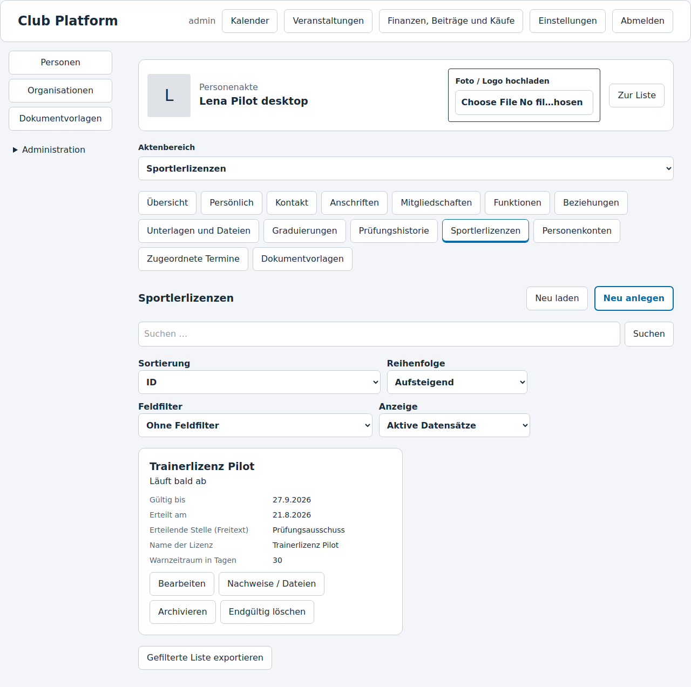

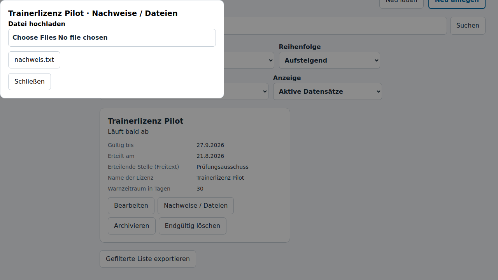

## Finanzen

### Währung, Konto und Kontostand

1. Definiere die Währung an der Organisation über die Finanzmodulansicht.
2. Öffne **Finanzen, Beiträge und Käufe** und lade den Arbeitsbestand neu.
3. Wähle den Vorgang **Konto anlegen**, den Inhaber und die Organisation.
4. Speichere, lade neu und wähle das Konto in der oberen Kontoauswahl.
5. **Suchen** lädt Saldo und Buchungen. Dieselben Konten erscheinen berechtigt
   auch im Finanzreiter der Personenakte.

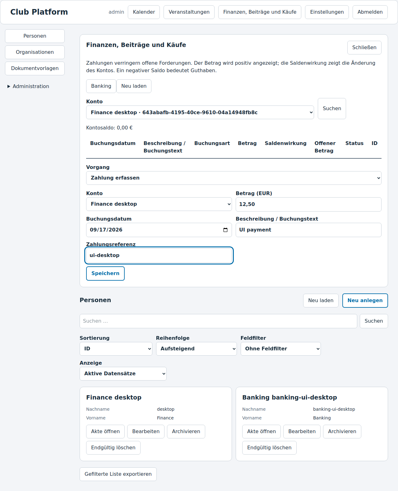

Ein Betrag wird in der Oberfläche als `12,50` EUR eingegeben, nicht als `1250`.
Währungen mit null beziehungsweise drei Nachkommastellen werden entsprechend
behandelt. Die technische API arbeitet weiterhin in kleinsten Währungseinheiten;
das ist kein Eingabeformat für den normalen Benutzer.

| Vorgang | Betrag | Saldenwirkung |
|---|---|---|
| Forderung | 30,00 EUR | +30,00 EUR: Person schuldet der Organisation Geld |
| Zahlung | 12,50 EUR | −12,50 EUR: offene Schuld sinkt |
| Rest nach beiden Vorgängen | | 17,50 EUR offen |
| Zahlung ohne offene Forderung | 12,50 EUR | −12,50 EUR: Guthaben |

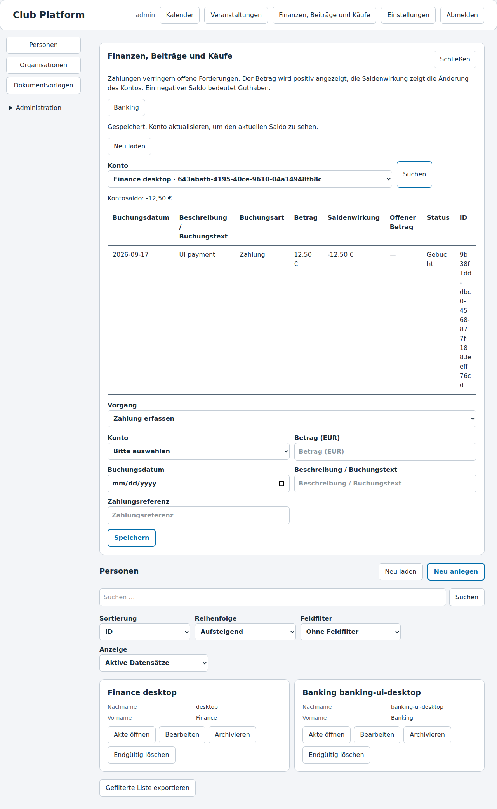

Das Minuszeichen einer Zahlungswirkung ist daher kein negativer Zahlungseingang.
Die Spalten **Betrag** und **Saldenwirkung** haben unterschiedliche Bedeutungen.

### Forderung, Zahlung und Zuordnung

**Forderung buchen:** Konto, Betrag, Buchungsdatum, Fälligkeit und Beschreibung
erfassen. **Zahlung erfassen:** Konto, Betrag, Buchungsdatum, Beschreibung und
Zahlungsreferenz erfassen. Speichern jeweils bestätigen.

Lade danach das Konto erneut. Wähle **Zahlung zuordnen**, die Zahlung, die offene
Forderung und den zuzuordnenden Betrag. Eine Teilzuordnung lässt den Rest offen.
Ein über die Forderung hinausgehender Zahlungsrest bleibt verfügbar und kann
einer weiteren Forderung desselben Kontos zugeordnet werden.

### Falsche Buchung korrigieren

Lade das betroffene Konto, wähle **Buchung stornieren**, den Beleg, Datum und
Begründung. Bestätige den Vorgang. Prüfe Gegenbuchung und gegebenenfalls gelöste
Zuordnungen. Erfasse anschließend den korrekten Vorgang. Gebuchte Historie wird
nicht überschrieben. Nach einem Transportfehler zuerst neu laden; eine neue
Zahlungsreferenz bei jedem Versuch würde keine zuverlässige Dublettenprüfung ergeben.

## Beiträge und Mahnungen

Voraussetzung: aktive Organisation, Mitgliedschaft, Finanzkonto sowie
freigeschaltete Module Finanzen und Beiträge.

1. **Beitragsplan anlegen:** Organisation, Name, Betrag, Gültigkeitsbeginn/-ende,
   Monatsintervall und Fälligkeitstag erfassen. Beispielsweise Intervall `1`
   für monatlich oder `3` für vierteljährlich.
2. **Beitrag zuweisen:** Mitgliedschaft, Plan, Konto und gültigen Zeitraum wählen.
3. Bei Bedarf einen individuellen Betrag eintragen. Er ersetzt den Planbetrag.
   Der Rabatt wird anschließend angewendet. Das aktuelle Formular verwendet
   Basispunkte: `1000` = 10 %, `5000` = 50 %, `10000` = 100 %.
4. **Beiträge abrechnen:** Zuweisung und Stichtag wählen. Erst dieser Schritt
   erzeugt die fälligen Beitragsforderungen im Ledger.
5. Konto neu laden und Perioden, Beträge und Fälligkeiten kontrollieren.
6. Bei einem Wechsel die bisherige Zuweisung beenden und eine neue anlegen.
   Vermeide überlappende Zeiträume. Bereits abgerechnete Zeiträume können nicht
   rückwirkend durch ein verkürztes Ende verschwinden.

Die erste Periode beginnt am Zuweisungsbeginn. Es gibt keine taggenaue anteilige
Beitragsberechnung. Fälligkeitstage am Monatsende werden auf den verfügbaren
Monatsletzten begrenzt. Wiederholtes Abrechnen desselben Zeitraums erzeugt keine
zweite Beitragsforderung.

Für eine offene, fällige Beitragsforderung wähle **Mahnstufe erfassen**. Trage
Ausstellungsdatum, neue Frist, Gebühr und Beschreibung ein. Eine Gebühr von null
eignet sich für eine Zahlungserinnerung. Das Speichern dokumentiert die Mahnung;
es versendet keine Nachricht und überweist kein Geld.

## Produkte, Käufe und Rückgaben

1. Unter **Produkt anlegen** Organisation, Name, Beschreibung und Preis erfassen.
2. Neu laden. Unter **Produkt ändern** ein bestehendes Produkt wählen und seine
   aktuellen Werte/Revision verwenden. Deaktivieren nimmt es aus der Kaufauswahl.
3. **Kauf buchen:** Konto, Buchungsdatum, Fälligkeit und Beschreibung wählen.
4. Produkt und ganzzahlige Menge auswählen, **Position hinzufügen** wählen.
   Wiederhole das für weitere Positionen. Entferne falsche Positionen vor dem Speichern.
5. Prüfe die Liste und bestätige den Kauf. Es sind höchstens 100 Positionen vorgesehen.
6. Lade das Konto und kontrolliere die gemeinsame Forderung.
7. **Rückgabe buchen:** vorhandene Kaufposition, Rückgabemenge, Datum und Begründung
   wählen. Die Rückgabe verwendet den damaligen Preis; eine spätere Preisänderung
   verändert den alten Kauf nicht.

Eine Gutschrift beziehungsweise Gegenbuchung ist keine Bankauszahlung. Eine
tatsächliche Rücküberweisung musst Du außerhalb dieser Banking-Grundstufe ausführen.

## Bankimport und Zahlungszuordnung

### Bankkonto einrichten

Öffne den Finanzbereich und **Banking**. Lege ein Bankkonto mit Organisation,
verständlichem Namen und gültiger IBAN an. Seine Währung muss zur Organisation
passen. Lade neu und wähle dieses Bankkonto vor jedem Import ausdrücklich aus.

### CSV mit eigenem Mapping importieren

1. Exportiere den Auszug aus Deiner Bank als UTF-8-CSV. Die maximale Dateigröße
   beträgt 2 MiB; passe die Exportperiode bei größeren Dateien an.
2. Wähle CSV und lade die Datei.
3. Lade ein passendes JSON-Mapping oder bearbeite es im Mappingfeld. Im Portal
   kannst Du das Mapping für den nächsten Import speichern.
4. Ordne Buchungstag, Betrag, Verwendungszweck, Referenz und Name den tatsächlichen
   Spaltenüberschriften beziehungsweise Spaltennummern zu.
5. Prüfe Trennzeichen, Kopfzeile, Datumsformat, Dezimal-/Tausendertrennzeichen,
   Währung und gegebenenfalls Soll-/Haben-Kennzeichen.
6. Wähle **Vorschau prüfen**. Bis dahin ist noch kein Bankposten und keine Zahlung gebucht.
7. Vergleiche mehrere Zeilen mit dem Originalauszug, insbesondere Beträge,
   Vorzeichen, Datum und Referenz. Auch Umlaute müssen korrekt erscheinen.
8. Erst danach **Posten importieren** bestätigen.

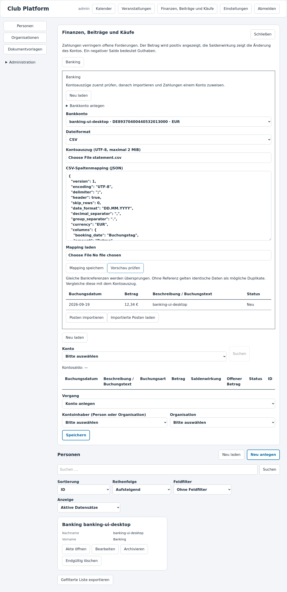

Das [Mappingbeispiel](../../resources/banking/csv-mapping.json) und der
[vollständige Vertrag](../banking.md) beschreiben die JSON-Eigenschaften.
Ein frei definierbares Mapping ist keine automatische Erkennung jedes Bankformats.
CAMT.053 wird in einem begrenzten dokumentierten Profil unterstützt; andere XML-
Formate dürfen nicht lediglich in `.xml` umbenannt werden.

### Eingänge buchen und abgleichen

1. Wähle beim importierten Eingang das richtige Personen-/Organisationskonto.
2. Prüfe die vorgeschlagenen offenen Forderungen. Eine passende Referenz oder
   ein passender Betrag ist eine Empfehlung, keine automatische Bestätigung.
3. Wähle die Forderung oder lasse den Eingang zunächst ohne Forderungszuordnung.
4. Bestätige **Zahlung übernehmen**.
5. Öffne das Finanzkonto und kontrolliere Zahlung, Zuordnung und Restbetrag.

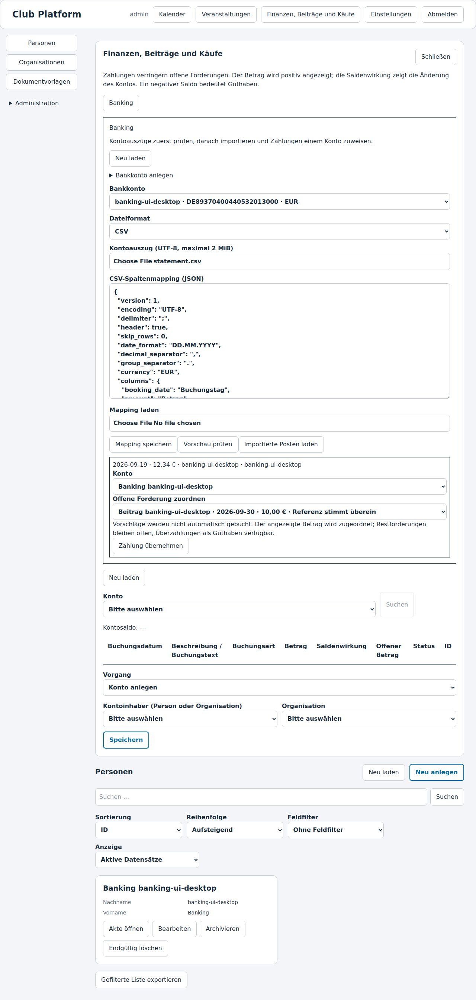

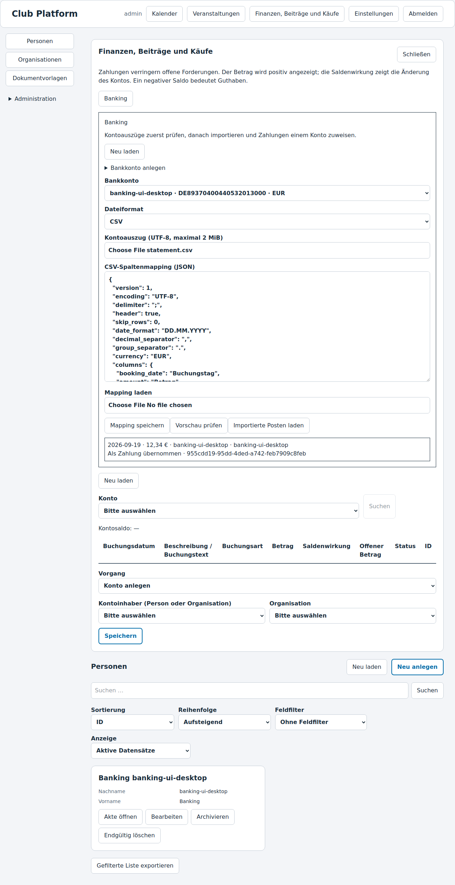

Beispiel: Eine Forderung beträgt 10,00 EUR, der Eingang 12,34 EUR. Nach vollständiger
Zuordnung ist die Forderung ausgeglichen; 2,34 EUR bleiben unzugeordnet verfügbar.
Ein Eingang von 6,00 EUR lässt dagegen 4,00 EUR Forderungsrest offen.

Ein wiederholt importierter bekannter Posten wird als Duplikat behandelt. Ohne
eindeutige Bankreferenz ist die Erkennung schwächer: Zwei tatsächlich getrennte,
inhaltlich identische Vorgänge können zusammenfallen. Prüfe solche Fälle am Original.
Bei mehr als einer Seite verwende **Weitere Buchungen laden**.

Abgänge werden zur manuellen Prüfung angezeigt. Diese Version bucht sie nicht
automatisch als Zahlungseingänge. Es gibt keinen direkten Bankabruf, SEPA-Export
oder unbeaufsichtigtes Matching.

## Kalender und Erinnerungen

### Termin anlegen

1. Öffne **Kalender**. Wähle den Monat und klicke den gewünschten Tag an.
2. Im Dialog ist das Datum vorbelegt. Trage Titel, Beschreibung und Ort ein.
3. Wähle die zugeordnete Person oder Organisation.
4. Prüfe Beginn und Ende mit Datum/Uhrzeit sowie die Zeitzone, z. B. `Europe/Berlin`.
5. Wähle gegebenenfalls ganztägig oder Wiederholung und speichere.
6. Lade neu und kontrolliere den Eintrag in Kalender und Personenakte.

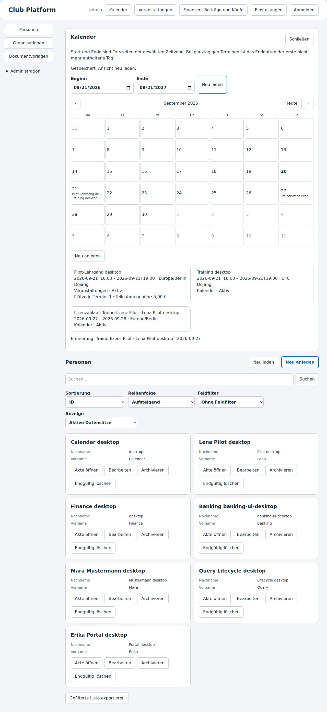

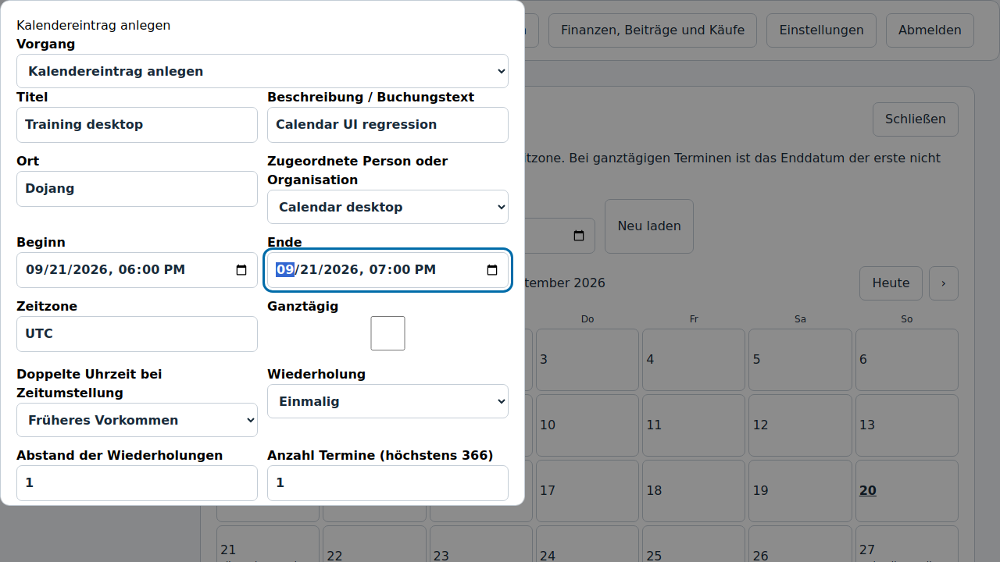

Bei ganztägigen Terminen ist das Enddatum exklusiv: Ein Tag vom 1. bis 2. Oktober
belegt den 1. Oktober. Wiederholungen unterstützen täglich, wöchentlich oder
monatlich mit Intervall und endlicher Anzahl (höchstens 366 Vorkommen).
Nicht existierende Monatstage werden übersprungen; aus dem 31. Januar folgt
bei monatlicher Wiederholung nicht automatisch der letzte Februartag.

Bei der Zeitumstellung können Uhrzeiten fehlen oder doppelt vorkommen. Nicht
existierende lokale Uhrzeiten werden abgelehnt. Bei doppelten Uhrzeiten legt
die Auswahl „früher/später“ fest, welche gemeint ist.

### Erinnern, bestätigen und absagen

Wähle den Erinnerungsvorgang, das Vorkommen und die Minuten Vorlauf. Erinnerungen
gehören Deinem Benutzerkonto. Die Kalenderansicht zeigt fällige Erinnerungen
und aktualisiert diese regelmäßig. Bestätige erledigte Erinnerungen dort.
Die Anwendung sendet keine E-Mail und keine Push-Nachricht.

Ein eigenes Kalender-Vorkommen kannst Du über den Absagevorgang auswählen und
absagen. Abgeleitete Veranstaltungen und Lizenzfristen werden in ihrer jeweiligen
Fachquelle geändert. Für eine Terminserie sind einzelne Vorkommen und die
zugrunde liegende Serie auseinanderzuhalten.

Die Personenzuordnung und aktuelle Organisationsfunktionen bestimmen zusammen
mit Grund- und Bereichsrechten, wer den Termin sehen darf. Ein Benutzer ohne
entsprechenden Zugriff sieht durch die bloße Kalenderlizenz keine fremden Termine.

## Veranstaltungen

Veranstaltungen verwalten Anmeldung und Kapazität. Kostenlose Veranstaltungen
können ohne Kalender und ohne Finanzen verwendet werden. Für Teilnahmegebühren
müssen Finanzmodul und Schreibrecht verfügbar sein.

1. Öffne **Veranstaltungen** und den Anlagevorgang.
2. Erfasse Titel, Beschreibung, Kategorie, Ort, Organisation und verantwortliche Person.
3. Gib Beginn, Ende, Zeitzone und gegebenenfalls Wiederholung ein.
4. Lege Anmeldebeginn, Anmeldeschluss und Platzanzahl fest.
5. Gib Gebühr und passende Organisationswährung an; für kostenlos Gebühr null.
6. Speichere und lade neu.

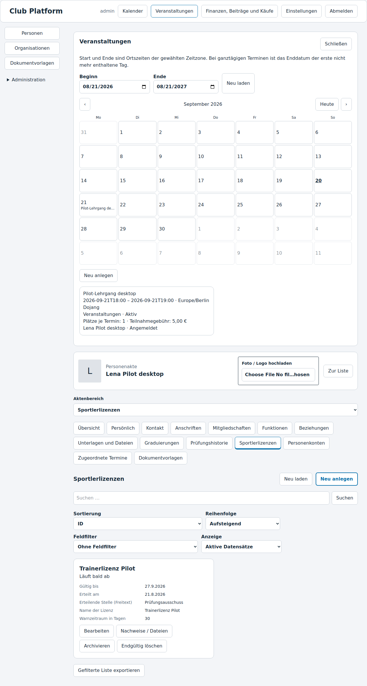

**Anmelden:** Vorkommen und Person wählen. Bei Gebühren zusätzlich das passende
Finanzkonto derselben Person/Organisation wählen. Anmeldung oder Einladung
auswählen und bestätigen. Einladungen reservieren noch keinen Platz.

**Warteliste:** Sind die Plätze belegt, landen weitere Anmeldungen auf der Warteliste.
Nach einer Absage bestätige den ersten Wartenden ausdrücklich. Die Reihenfolge
ist geschützt; es wird niemand stillschweigend über die Kapazität hinaus bestätigt.

**Teilnahmestatus ändern:** Teilnehmer und aktuelle Revision wählen. Bestätigt,
abgesagt, teilgenommen und nicht erschienen sind unterschiedliche Zustände.
Anwesenheit kann erst ab Terminbeginn erfasst werden. Bei einem Revisionskonflikt
neu laden statt mit geratenen Revisionsnummern fortfahren.

**Kapazität ändern:** Vorkommen, bisherigen und neuen Wert angeben. Parallele
Änderungen führen zu einem Konflikt und müssen neu geprüft werden.

**Absagen:** Einzelne Teilnahme oder gesamten Termin absagen. Gebühren werden
gegebenenfalls gegengebucht; dies führt nicht zu einer automatischen Bankerstattung.
Eine abgesagte Teilnahme derselben Person am selben Vorkommen lässt sich derzeit
nicht durch eine erneute Anmeldung wieder eröffnen.

## Dokumente und Auswertungen

### Eine Vorlage erstellen und prüfen

1. Öffne **Dokumentvorlagen** in der Administration oder passenden Akte.
2. Wähle **Neu anlegen** und gib einen Titel ein.
3. Wähle den Geltungsbereich: global, Person, Organisation oder Mitgliedschaft.
4. Stelle Sprache/Format-Locale ein oder lasse die Vererbung bestehen.
5. Schreibe den Vorlagentext. Lade die Platzhalter und füge einen per Auswahl ein.
6. Wähle den konkreten Dokumentkontext. Bei mehreren Adressen, Mitgliedschaften,
   Funktionen oder Moduldatensätzen gib die gewünschte Auswahl ausdrücklich an.
7. Wähle **Vorschau**. Prüfe Namen, Datumswerte, leere Stellen und Organisation.
8. Speichere die Vorlage. Öffne **PDF-Vorschau** und lade `dokument.pdf` herunter.

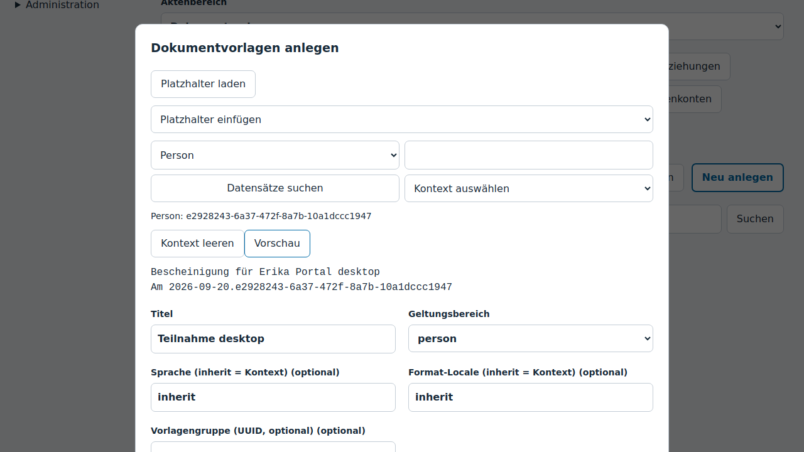

Ein einfaches Beispiel:

```text
Bescheinigung
Für {{person.full_name}}
Ausgestellt am {{document.date}}
```

Historische Aliase `{{given_name}}`, `{{family_name}}` und `{{date}}` bleiben
verwendbar. Unbekannte oder nicht berechtigte Platzhalter werden zurückgewiesen.
Eine Vorschau mit anderem Kontext kann deshalb ein anderes Ergebnis liefern.

Alle vorhandenen Platzhalter stehen in der [vollständigen Liste](placeholders.md).
Finanzen, Banking, Kalender und Sportlerlizenzen haben derzeit keinen eigenen
Dokument-Platzhalterprovider. Vorlagen übersetzen ihren Text nicht automatisch.
Datumsplatzhalter liefern derzeit ISO-Werte; eine vollständig localeabhängige
Dokumentformatierung und verifizierte Hangul-PDF-Ausgabe sind noch offene Gates.

### CSV-Auswertung

Filtere die gewünschte Personen-, Organisations-, Mitgliedschafts-, Funktions-
oder Modulliste und wähle **Gefilterte Liste exportieren**. Die Datei enthält
den berechtigten gefilterten Bestand, nicht nur die gerade sichtbare Seite;
große Exporte sind auf 5000 Datensätze begrenzt. Öffne sie als UTF-8-CSV.
Formelverdächtige Textanfänge werden zum Schutz von Tabellenkalkulationen maskiert.
Dieser Export ist kein vollständiges Datenbankbackup.

## Einstellungen

**Sprache** und **Format-Locale** sind getrennt wählbar. Beispielsweise kannst
Du englische Beschriftungen mit deutschen Datumsformaten verwenden. Verfügbare
UI-Sprachen sind Deutsch, Englisch, Französisch, Italienisch, Spanisch,
Koreanisch und Türkisch. Der Sprachwechsel beendet die Sitzung nicht.

Unter **Ansicht** beziehungsweise Einstellungen wählst Du hell, dunkel oder
Systemmodus und ein Farbschema. Der native Desktop bietet auch eigene Farben
und ein kontrastreiches Schema. Prüfe die Lesbarkeit von Text und Auswahlfarbe.

Administratoren können Logo und Hintergrund des Startbildschirms ändern.
Diese Bilder werden bereits **vor** der Anmeldung öffentlich für Benutzer der
Installation angezeigt. Verwende dafür keine vertraulichen Personendokumente.

Im nativen Desktop öffnet **Hilfe → Nach Updates suchen** die Versionsprüfung.
Bei einem privaten Repository kann ein Zugriffstoken erforderlich sein; er wird
nur für diese Prüfung verwendet. Die Prüfung installiert nichts automatisch.
Im Portal aktualisiert der Betreiber die bereitgestellten Dateien und den Host.

## Sicherung und Wiederherstellung

Der folgende Ablauf ist eine Betreiberaufgabe. Verwende die Werkzeuge aus dem
privaten Code-Repository. Ein Backup enthält personenbezogene Informationen und
Passworthashes und gehört in ein geschütztes Verzeichnis.

```bash
python3 scripts/pilot-data.py backup /pfad/data.sqlite /pfad/backups/vor-upgrade
python3 scripts/pilot-data.py diagnose /pfad/backups/vor-upgrade/database.sqlite
python3 scripts/pilot-data.py restore /pfad/backups/vor-upgrade /pfad/restore/data.sqlite
```

1. Sichere vor einem Upgrade. Das SQLite-Backupverfahren erfasst auch bereits
   bestätigte WAL-Änderungen und enthält Dateien, die in der Datenbank gespeichert sind.
2. Sichere zusätzlich die zum Betrieb gehörende Konfiguration, vertrauenswürdige
   Moduldateien, Signatur-/Aktivierungskonfiguration und erforderliche externe Dateien.
3. Stelle in ein **neues** Datenbankziel wieder her. Ein bestehendes Ziel wird
   nicht überschrieben. Prüfsumme, Migrationen und Datenbankintegrität werden geprüft.
4. Starte einen getrennten Testhost mit diesem Ziel und den passenden Moduldateien.
5. Melde Dich neu an; alte Sitzungen werden beim Restore widerrufen.
6. Prüfe Personen, Anlagen, Module, Finanzsaldo, Zuordnungen, Banking und Termine.
7. Stoppe den bisherigen Host, bevor Du einen produktiven Datenbankwechsel durchführst.

Diese Befehle gelten für SQLite. Für PostgreSQL verwende das abgestimmte
Datenbank-Backup-/Restoreverfahren; der SQLite-Helfer ersetzt dieses nicht.
Eine Datenbankkopie aktiviert auf einem anderen Rechner keine gebundene Lizenz.

## Fehler und Prüfliste

| Beobachtung | Prüfung / Abhilfe |
|---|---|
| Modul fehlt in der Navigation | Lizenz, Aktivierung, Installation, Modulstatus und Benutzerrechte prüfen |
| „Datei nicht geladen“ | Richtigen Host, Modulpfad und passende Modulversion prüfen; neu starten |
| „Keine Tests gefunden“ | Im konfigurierten Buildverzeichnis testen, z. B. `build/user-macos-vscode-debug` |
| Qt wird beim Konfigurieren nicht gefunden | Qt-Pfad im persönlichen Preset korrigieren; ein fehlgeschlagenes Configure erzeugt keinen funktionsfähigen Build |
| Organisation/Person kann nicht gelöscht werden | Referenzen prüfen; gegebenenfalls archivieren statt endgültig löschen |
| Recht kann nicht entfernt werden | Selbstschutz/letzten Administrator und indirekte Gruppenwirkung prüfen |
| Kontosaldo nach Zahlung negativ | Guthaben beziehungsweise negative Saldenwirkung ist beabsichtigt |
| Betrag/Währung passt nicht | Organisationswährung und Nachkommastellen vor Buchung prüfen |
| Bankvorschau falsch | Mapping, Kodierung, Datum und Soll/Haben korrigieren; noch nicht importieren |
| Gespeichert, aber nicht sichtbar | Neu laden sowie Filter, Archivstatus und richtigen Datenbestand prüfen |
| Konflikt beim Speichern | Neu laden und konkurrierende Änderungen vergleichen |
| Person sieht Termin nicht | Benutzer-/Personenverknüpfung, Mitgliedschaft, aktuelle Funktion und Bereichsrechte prüfen |
| Dokumentkontext mehrdeutig | Adresse/Mitgliedschaft/Funktion/Moduldatensatz ausdrücklich auswählen |

Für Deinen eigenen Pilot verwende eine getrennte Organisation und mindestens
zwei Benutzer: Administrator und eingeschränkter Benutzer. Prüfe eine Person mit
Mitgliedschaft, Sportlerlizenz, Nachweis, Konto und Termin. Importiere danach einen
anonymisierten echten Bankexport und gleiche Gesamtbetrag sowie Referenzen mit
dem Original ab. Prüfe abschließend ein wiederhergestelltes Backup. Der
[Pilotbericht](../pilot.md) trennt die automatischen Prüfergebnisse von dieser
noch erforderlichen fachlichen Abnahme.
