# Form reference

This reference lists every field of the available finance and scheduling actions. Open the area, select the action and fill in its fields. Review before saving/confirming, then reload. Create referenced records first and reload to populate empty selectors. Screenshots show the actual forms using test data; they do not certify a business posting.

[Back to handbook](handbook.md) · [Screenshots](../images/pilot/README.md)

## Finance

### Create account

`finance` · `account.create`

| Field | Input | Required |
|---|---|---|
| Account owner (person or organization) | Selection | Required |
| Organization | Selection | Required |

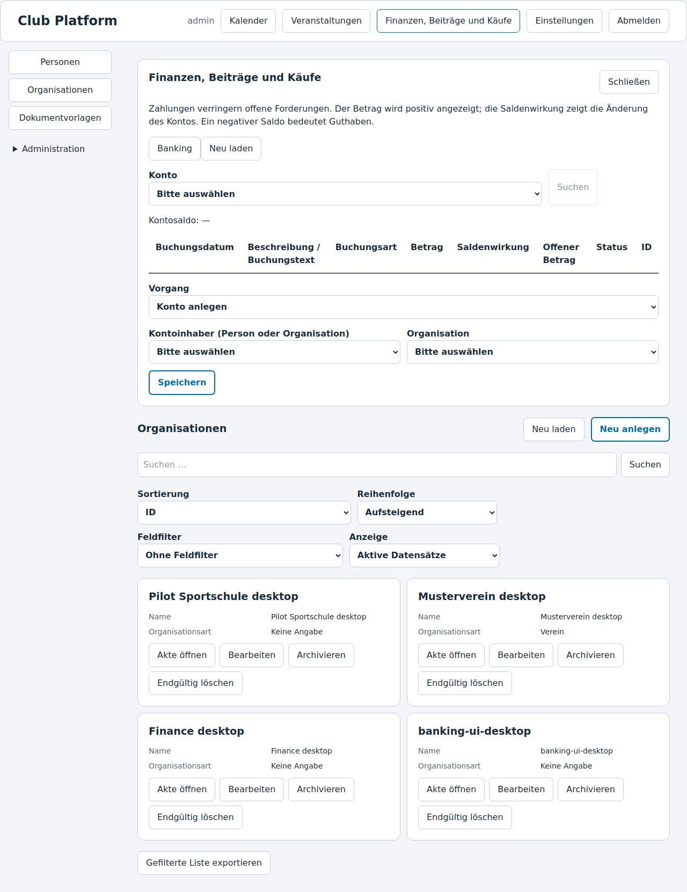

### Post receivable

`finance` · `receivable.create`

| Field | Input | Required |
|---|---|---|
| Account | Selection | Required |
| Amount | Amount in organization currency | Required |
| Booking date | Date | Required |
| Due date | Date | Required |
| Description / entry text | Text | Required |

### Record payment

`finance` · `payment.create`

| Field | Input | Required |
|---|---|---|
| Account | Selection | Required |
| Amount | Amount in organization currency | Required |
| Booking date | Date | Required |
| Description / entry text | Text | Required |
| Payment reference | Text | Required |

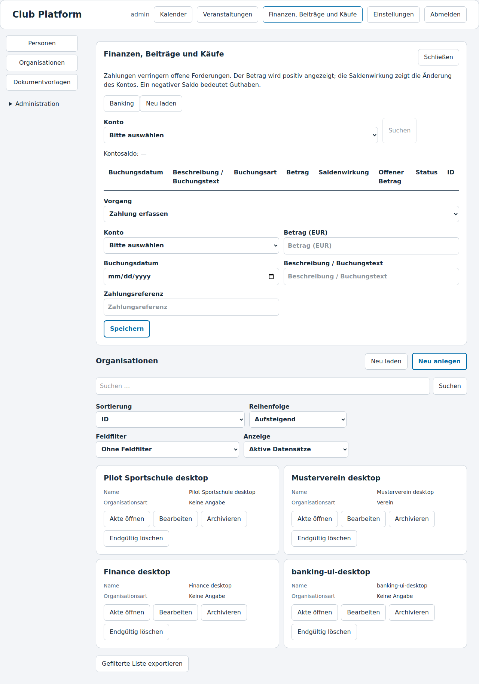

### Allocate payment

`finance` · `allocation.create`

| Field | Input | Required |
|---|---|---|
| Payment | Selection | Required |
| Receivable | Selection | Required |
| Amount | Amount in organization currency | Required |

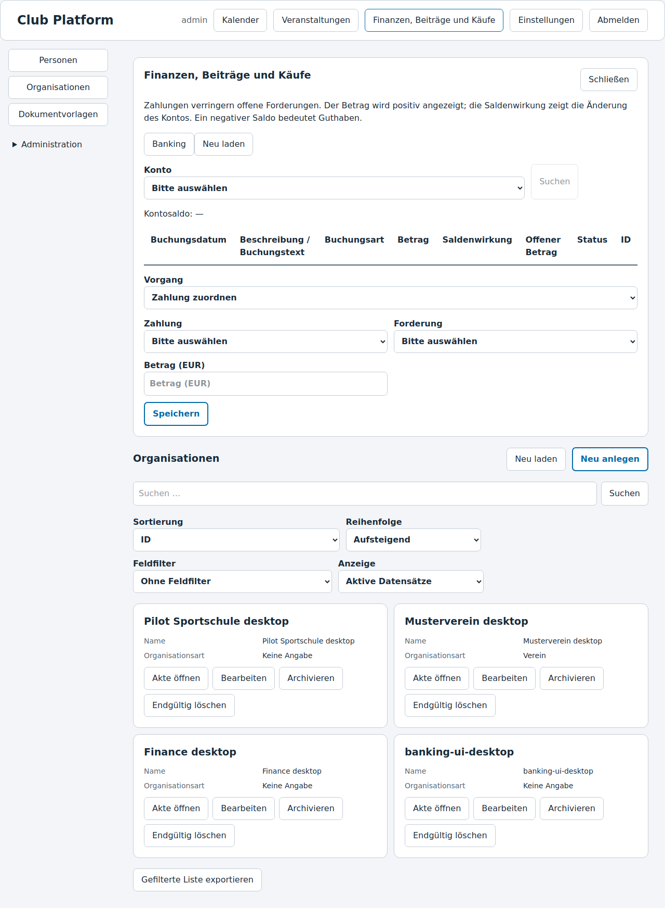

### Reverse entry

`finance` · `entry.reverse`

| Field | Input | Required |
|---|---|---|
| Entry | Selection | Required |
| Booking date | Date | Required |
| Description / entry text | Text | Required |

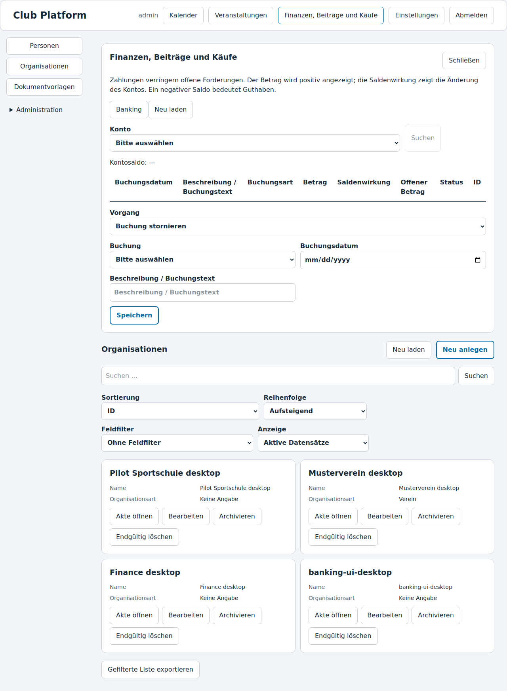

### Create contribution plan

`contributions` · `plan.create`

| Field | Input | Required |
|---|---|---|
| Organization | Selection | Required |
| Name | Text | Required |
| Amount | Amount in organization currency | Required |
| Interval (1, 3, 6 or 12 months) | Integer | Required |
| Valid from | Date | Required |
| Valid until | Date | Required |
| Due day of month (1–31) | Integer | Required |

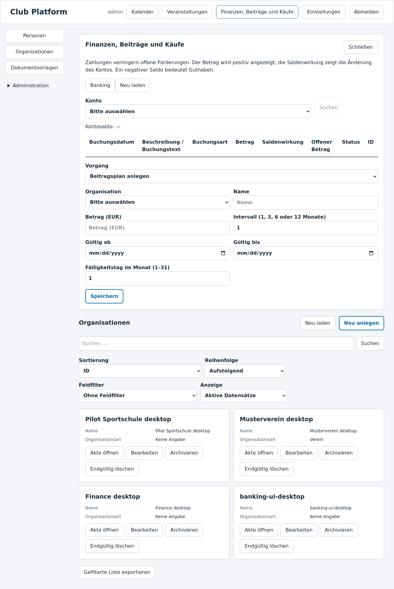

### Assign contribution

`contributions` · `assignment.create`

| Field | Input | Required |
|---|---|---|
| Memberships | Selection | Required |
| Contribution plan | Selection | Required |
| Account | Selection | Required |
| Valid from | Date | Required |
| Valid until | Date | Required |
| Custom amount | Amount in organization currency | Optional |
| Discount (100 = 1%, 10000 = 100%) | Integer | Required |

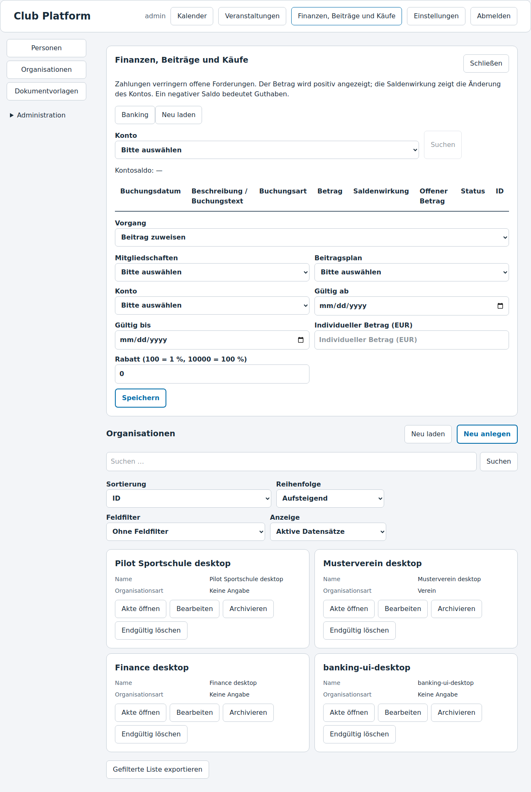

### End contribution assignment

`contributions` · `assignment.end`

| Field | Input | Required |
|---|---|---|
| Contribution assignment | Selection | Required |
| Valid until | Date | Required |

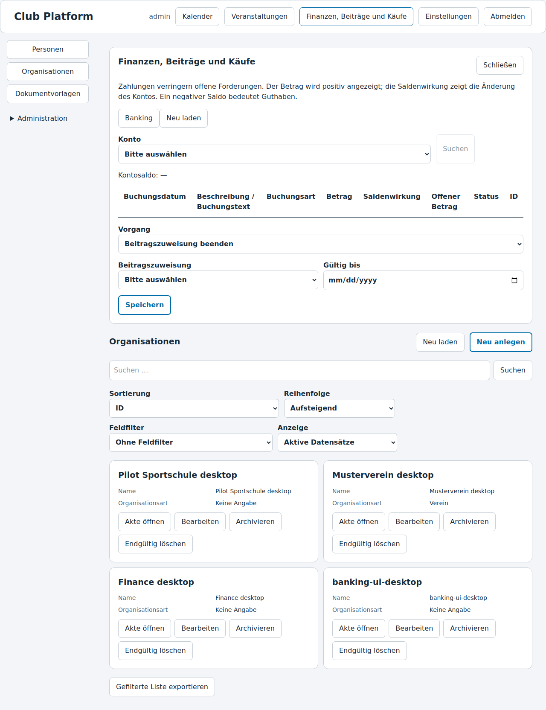

### Bill contributions

`contributions` · `contributions.bill`

| Field | Input | Required |
|---|---|---|
| Contribution assignment | Selection | Required |
| Bill through (inclusive) | Date | Required |

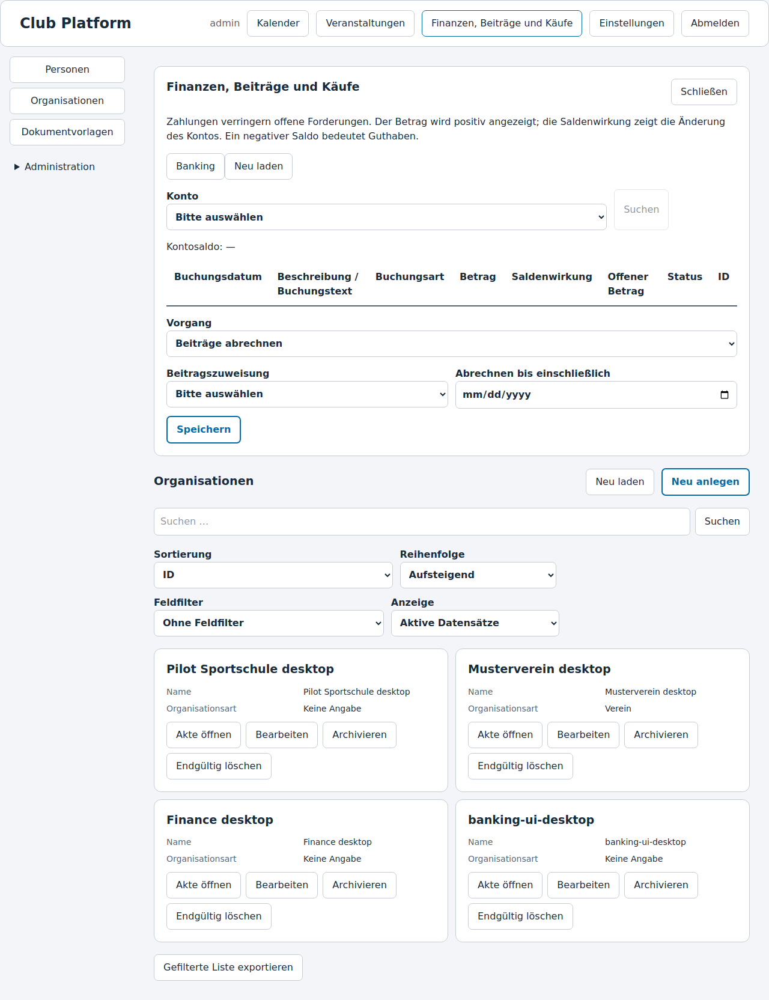

### Record reminder stage

`contributions` · `reminder.create`

| Field | Input | Required |
|---|---|---|
| Receivable | Selection | Required |
| Reminder date | Date | Required |
| Payment deadline | Date | Required |
| Fee | Amount in organization currency | Required |
| Description / entry text | Text | Required |

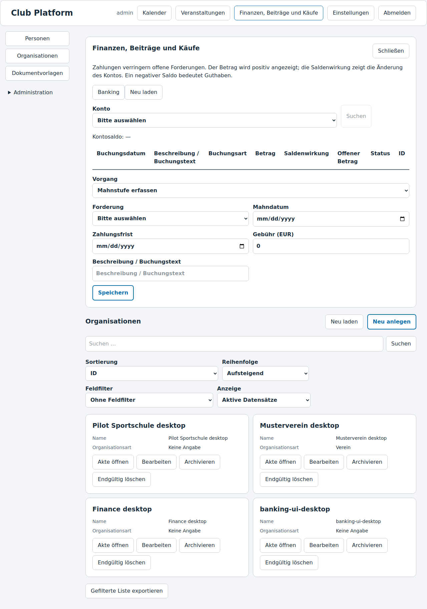

### Create product

`purchases` · `product.create`

| Field | Input | Required |
|---|---|---|
| Organization | Selection | Required |
| Name | Text | Required |
| Description / entry text | Text | Required |
| Price | Amount in organization currency | Required |

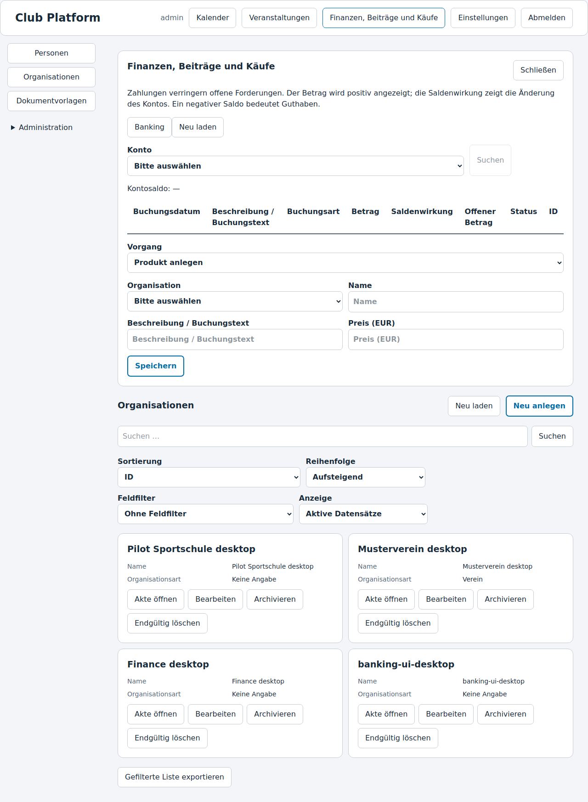

### Update product

`purchases` · `product.update`

| Field | Input | Required |
|---|---|---|
| Product | Selection | Required |
| Product revision | Integer | Required |
| Name | Text | Required |
| Description / entry text | Text | Required |
| Price | Amount in organization currency | Required |
| Active | Yes/No | Required |

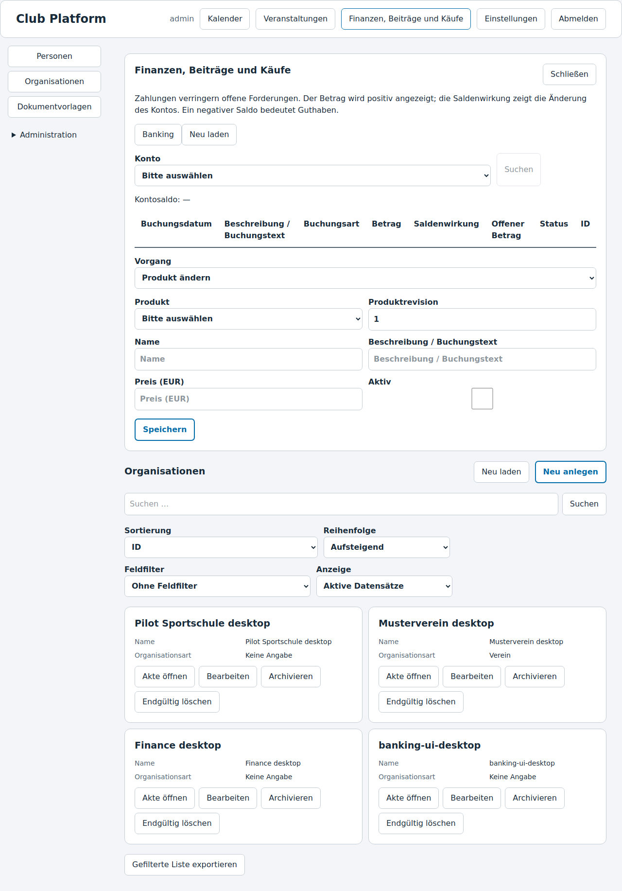

### Post purchase

`purchases` · `purchase.post`

| Field | Input | Required |
|---|---|---|
| Account | Selection | Required |
| Booking date | Date | Required |
| Due date | Date | Required |
| Description / entry text | Text | Required |

Purchase items: Product · Quantity · Add item / Remove item.

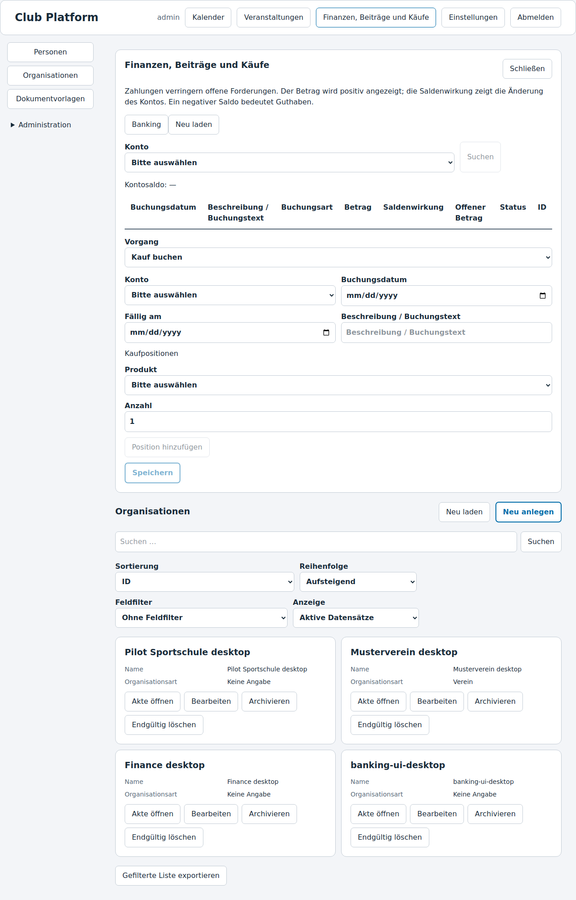

### Post return

`purchases` · `purchase.return`

| Field | Input | Required |
|---|---|---|
| Purchase item | Selection | Required |
| Quantity | Integer | Required |
| Booking date | Date | Required |
| Description / entry text | Text | Required |

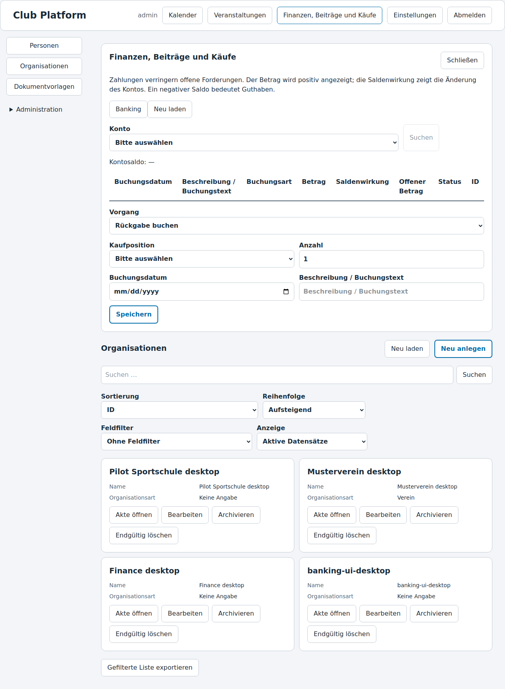

## Calendar and events

### Create calendar entry

`calendar` · `create`

| Field | Input | Required |
|---|---|---|
| Title | Text | Required |
| Description / entry text | Text | Required |
| Location | Text | Required |
| Assigned person or organization | Selection | Required |
| Start | Date and time | Required |
| End | Date and time | Required |
| Time zone | Text | Required |
| All day | Yes/No | Required |
| Repeated time at clock change | earlier, later | Required |
| Repeat | none, DAILY, WEEKLY, MONTHLY | Required |
| Repeat interval | Integer | Required |
| Number of occurrences (up to 366) | Integer | Required |

### Cancel calendar occurrence

`calendar` · `cancel`

| Field | Input | Required |
|---|---|---|
| Occurrence | Selection | Required |

### Set reminder

`calendar` · `remind`

| Field | Input | Required |
|---|---|---|
| Occurrence | Selection | Required |
| Reminder: minutes before | Integer | Required |

### Dismiss reminder

`calendar` · `acknowledge`

| Field | Input | Required |
|---|---|---|
| Reminder | Selection | Required |

### Create event

`events` · `create`

| Field | Input | Required |
|---|---|---|
| Title | Text | Required |
| Description / entry text | Text | Required |
| Category | Text | Required |
| Location | Text | Required |
| Organization | Selection | Required |
| Responsible person | Selection | Required |
| Start | Date and time | Required |
| End | Date and time | Required |
| Time zone | Text | Required |
| All day | Yes/No | Required |
| Repeated time at clock change | earlier, later | Required |
| Repeat | none, DAILY, WEEKLY, MONTHLY | Required |
| Repeat interval | Integer | Required |
| Number of occurrences (up to 366) | Integer | Required |
| Registration opens | Date and time | Required |
| Registration deadline | Date and time | Required |
| Places per occurrence | Integer | Required |
| Participation fee | Amount in organization currency | Required |
| Currency | Text | Required |

### Register / invite participant

`events` · `register`

| Field | Input | Required |
|---|---|---|
| Occurrence | Selection | Required |
| Person | Selection | Required |
| Account | Selection | Optional |
| Status | registered, invited | Required |

### Change participant status

`events` · `participant`

| Field | Input | Required |
|---|---|---|
| Participant | Selection | Required |
| Record version | Integer | Required |
| Status | registered, confirmed, cancelled, attended, no_show | Required |

### Change capacity

`events` · `capacity`

| Field | Input | Required |
|---|---|---|
| Occurrence | Selection | Required |
| Previous capacity | Integer | Required |
| Places per occurrence | Integer | Required |

### Cancel event occurrence

`events` · `cancel`

| Field | Input | Required |
|---|---|---|
| Occurrence | Selection | Required |
